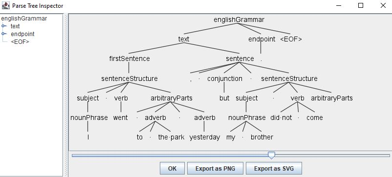
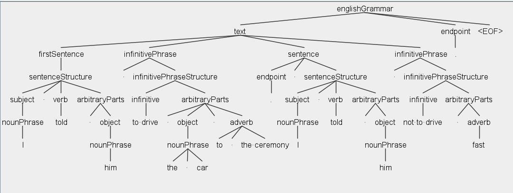
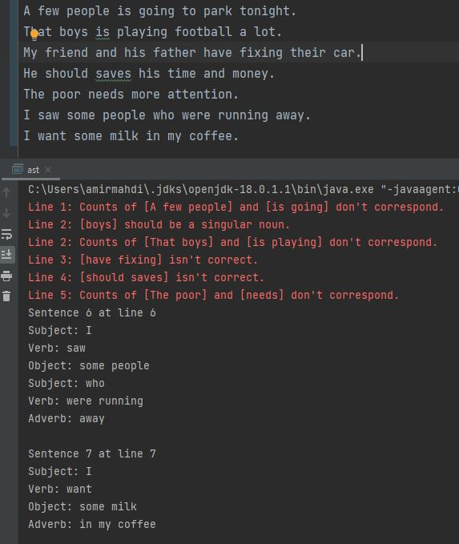
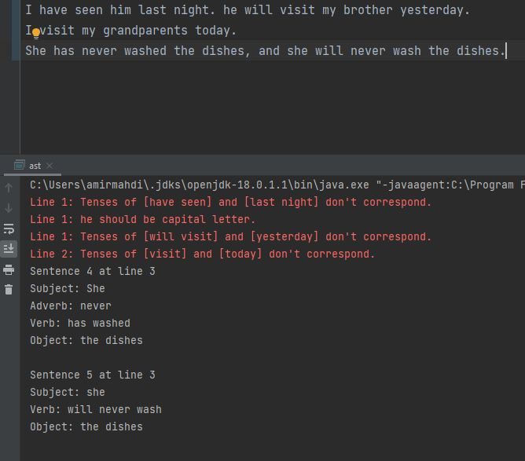

# GrammarEditor
Detection of parts of speech and grammatical mistakes in English sentences through using production rules.

### How to run: 

You should download the ANTLR tool for running the project. Please read $\textbf{Guidance for How to Run GrammarEditor.pdf}$ and install $\textbf{ANTLR.jar}$ file included in the installation folder.

### Explanation:

This project is mainly about how some sentence structures in English can be detected using production (parsing) rules, which I have been taught in the Theory of Computation and Compiler Design courses. When a sentence (more generally, a string) is matched with a production rule, the words in that string will receive their parts of speech. Consider the following compound sentence as an example:

`
I went to the park yesterday, but my brother did not come.
`

The structure of the above sentence is:

`
subject + verb + adverb + adverb + conjunction + subject + verb
`

(Pay attention that the main sentence itself is made up of two simple sentences connected by ', but' which is a conjunction). The output parsing tree is:

Another example with a more complex structure:

GrammarEditor can also detect some grammatical mistakes, including count and tense agreement between sentence components. This is done by defining semantic actions (in Java) between the nodes of the parsing tree. For example, in this sentence:

`
I have seen him last night.
`

The 'last night' adverb does not correspond with a present perfect verb. 

`
That boys is playing football a lot.
`

The counts of 'boys', 'That', and 'is' do not correspond. So the parser shows two errors.

$\textbf{Please read the report for more details about how GrammarEditor works.}$
